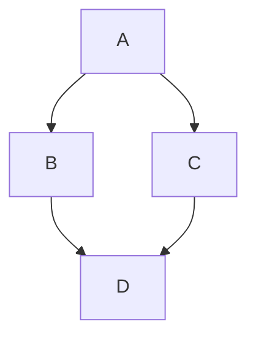
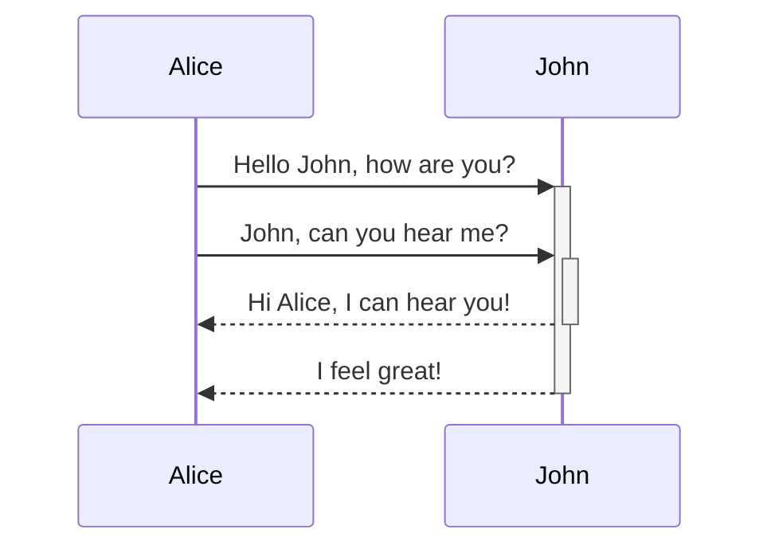
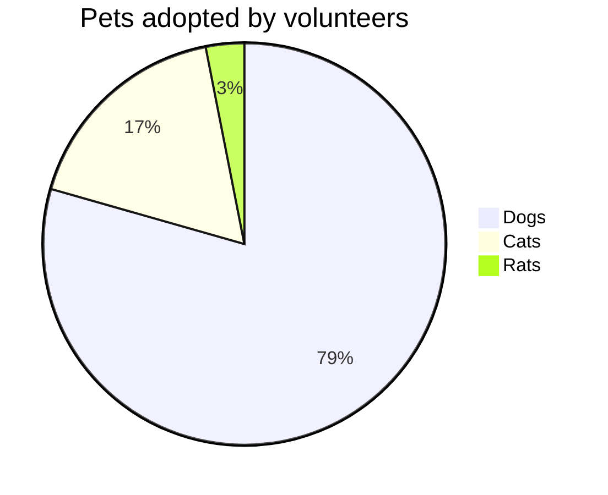

<docs-decorative-header title="廚房水槽" imgSrc="assets/images/components.svg"> <!-- markdownlint-disable-line -->
這是 Angular.dev 所有自訂元件和樣式的視覺清單。
</docs-decorative-header>

作為一個設計系統，此頁面包含以下內容的視覺和 Markdown 編寫指南：

* 自訂 Angular 文件元素：[`docs-card`](#cards)、[`docs-callout`](#callouts)、[`docs-pill`](#pills) 和 [`docs-steps`](#workflow)
* 自訂文字元素：[警告](#alerts)
* 程式碼範例：[`docs-code`](#code)
* 內建 Markdown 風格元素：連結、清單、[標題](#headers)、[水平線分隔線](#horizontal-line-divider)、[表格](#tables)
* 還有更多！

準備：

1. 寫...
2. 偉大的...
3. 文件！

## 標題 (h2)

### 較小的標題 (h3)

#### 更小 (h4)

##### 甚至更小 (h5)

###### 最小的！（h6）

## 卡片

<docs-card-container>
  <docs-card title="What is Angular?" link="Platform Overview" href="tutorials/first-app">
    Lorem ipsum dolor sit amet, consectetur adipiscing elit. Nullam ornare ligula nisi
  </docs-card>
  <docs-card title="Second Card" link="Try It Now" href="essentials/what-is-angular">
    Lorem ipsum dolor sit amet, consectetur adipiscing elit. Nullam ornare ligula nisi
  </docs-card>
    <docs-card title="No Link Card">
    Lorem ipsum dolor sit amet, consectetur adipiscing elit. Nullam ornare ligula nisi
  </docs-card>
</docs-card-container>

### `<docs-card>` 屬性

| 屬性                    | 細節                                               |
|:---                      |:---                                               |
| `<docs-card-container>`  | 所有卡片必須嵌套在容器內                               |
| `title`                  | 卡片標題                                          |
| 卡片主體內容              | `<docs-card>` 與 `</docs-card>` 之間的任何內容         |
| `link`                   | （選用）呼叫動作連結文字                             |
| `href`                   | （選用）呼叫動作連結 href                             |

## 說明文字

<docs-callout title="Title of a callout that is helpful">
  Lorem ipsum dolor sit amet, consectetur adipiscing elit. Nulla luctus metus blandit semper faucibus. Sed blandit diam quis tellus maximus, ac scelerisque ex egestas. Ut euismod lobortis mauris pretium iaculis. Quisque ullamcorper, elit ut lacinia blandit, magna sem finibus urna, vel suscipit tortor dolor id risus.
</docs-callout>

<docs-callout critical title="Title of a callout that is critical">
  Lorem ipsum dolor sit amet, consectetur adipiscing elit. Nulla luctus metus blandit semper faucibus. Sed blandit diam quis tellus maximus, ac scelerisque ex egestas. Ut euismod lobortis mauris pretium iaculis. Quisque ullamcorper, elit ut lacinia blandit, magna sem finibus urna, vel suscipit tortor dolor id risus.
</docs-callout>

<docs-callout important title="Title of a callout that is important">
  Lorem ipsum dolor sit amet, consectetur adipiscing elit. Nulla luctus metus blandit semper faucibus. Sed blandit diam quis tellus maximus, ac scelerisque ex egestas. Ut euismod lobortis mauris pretium iaculis. Quisque ullamcorper, elit ut lacinia blandit, magna sem finibus urna, vel suscipit tortor dolor id risus.
</docs-callout>

### `<docs-callout>` 屬性

| 屬性                                         | 詳細資料                                                  |
|:---                                            |:---                                                       |
| `title`                                        | 說明標題                                               |
| 卡片主體內容                                 | 在 `<docs-callout>` 和 `</docs-callout>` 之間的任何內容 |
| `helpful` (預設) | `critical` | `important` | (選用) 根據嚴重性等級新增樣式和圖示 |

## 丸藥

藥丸列有助於作為一種導航，其中包含指向有用資源的連結。

<docs-pill-row>
  <docs-pill href="#pill-row" title="連結"/>
  <docs-pill href="#pill-row" title="連結"/>
  <docs-pill href="#pill-row" title="連結"/>
  <docs-pill href="#pill-row" title="連結"/>
  <docs-pill href="#pill-row" title="連結"/>
  <docs-pill href="#pill-row" title="連結"/>
</docs-pill-row>

### `<docs-pill>` 屬性

| 屬性               | 詳細資料                                      |
|:---                      |:---                                          |
| `<docs-pill-row`         | 所有藥丸都必須嵌套在藥丸列中   |
| `title`                  | 藥丸文字                                    |
| `href`                   | 藥丸超連結                                    |

藥丸也可以單獨內嵌使用，但我們尚未建立該功能。

## 警示

警示只是一些特殊段落。它們有助於呼叫出（不要與呼叫混淆）一些更緊急的東西。它們從內容中獲得字體大小，並有許多級別。請勿嘗試使用警示來呈現太多內容，而應增強和引起對周圍內容的注意。

Style 警告以新行的格式在 Markdown 中開始，使用格式 `嚴重性等級` + `:` + `警告文字`。

注意：將註解用於非主要文字的輔助/補充資訊。

提示：使用提示來呼叫使用者可以執行的特定任務/動作，或直接影響任務/動作的事實。

TODO：使用 TODO 表示您計劃在不久的將來擴充套件的不完整文件。您也可以指定 TODO，例如 TODO(emmatwersky)：Text。

QUESTION：使用 Question 向讀者提出問題，就像是一個迷你測驗，他們應該可以回答。

摘要：使用摘要提供兩到三句的頁面或區段內容概要，以便讀者了解這是不是他們要找的地方。

TLDR：如果您可以用一兩句話提供關於頁面或章節的基本資訊，請使用 TL;DR (或 TLDR)。例如，TLDR：大黃是一隻貓。

CRITICAL：使用 Critical 來呼叫潛在的壞東西或警告讀者在做某事之前應該小心。例如，警告：以 `-f` 選項執行 `rm` 將刪除寫入保護的文件或目錄，而不會提示您。

重要：使用重要資訊來理解文字或完成某些任務。

有幫助的：使用最佳做法來呼叫出已知成功或優於其他替代做法的做法。

備註：各位`開發人員`，請注意！警示 _可以_ 有 [連結](#alerts) 和其他巢狀樣式（但請**盡量少用**）！

## 程式碼

您可以使用內建的三個反引號顯示 `code`：

```ts
example code
```

或者使用 `<docs-code>` 元素。

<docs-code header="Your first example" language="ts" linenums>
import { Component } from '@angular/core';

@Component({
  selector: 'example-code',
  template: '<h1>Hello World!</h1>',
})
export class ComponentOverviewComponent {}
</docs-code>

### Styling the example

Here's a code example fully styled:

<docs-code
  path="hello-world/src/app/app.component-old.ts"
  header="A styled code example"
  language='ts'
  linenums
  highlight="[[14,19], 27]"
  diff="hello-world/src/app/app.component.ts"
  preview
  visibleLines="[13,28]">
</docs-code>

We also have styling for the terminal, just set the language as `shell`:

<docs-code language="shell">
  npm install @angular/material --save
</docs-code>

#### `<docs-code>` Attributes

| Attributes               | Type        | Details                                              |
|:---                      |:---         |:---                                                  |
| code                     | `string`    | Anything between tags is treated as code             |
| `path`                   | `string`    | Path to code example (root: `content/examples/`)     |
| `header`                 | `string`    | Title of the example (default: `file-name`)          |
| `language`               | `string`    | code language                                        |
| `linenums`               | `boolean`   | (False) displays line numbers                        |
| `highlight`              | `string of number[]` | lines highlighted                           |
| `diff`                   | `string`    | path to changed code                                 |
| `visibleLines`           | `string of number[]` | range of lines for collapse mode            |
| `visibleRegion`          | `string`    | **DEPRECATED** FOR `visibleLines`                    |
| `preview`                | `boolean`   | (False) display preview                              |

### Multifile examples

You can create multifile examples by wrapping the examples inside a `<docs-code-multifile>`.

<docs-code-multifile
  path="hello-world/src/app/app.component.ts"
  preview>
  <docs-code
    path="hello-world/src/app/app.component-old.ts"
    diff="hello-world/src/app/app.component.ts"
    visibleLines="[11, [13, 31]]"/>
  <docs-code
    path="hello-world/src/app/app.component.html"
    visibleLines="[1, 2]"
    linenums/>
  <docs-code
    path="hello-world/src/app/app.component.css"
    highlight="[2]"/>
</docs-code-multifile>

#### `<docs-code-multifile>` Attributes

| Attributes               | Type        | Details                                          |
|:---                      |:---         |:---                                              |
| body contents            | `string`    | nested tabs of `docs-code` examples              |
| `path`                   | `string`    | Path to code example for preview and external link |
| `preview`                | `boolean`   | (False) display preview                          |

### Adding `preview` to your code example

Adding the `preview` flag builds a running example of the code below the code snippet. This also automatically adds a button to open the running example in Stackblitz.

Note: `preview` only works with standalone.

#### built-in-template-functions

<docs-code-multifile
  path="built-in-template-functions/src/app/app.component.ts"
  preview>
  <docs-code
    path="built-in-template-functions/src/app/app.component.ts" linenums/>
  <docs-code
    path="built-in-template-functions/src/app/app.component.html"
    linenums/>
</docs-code-multifile>

#### user-input

<docs-code-multifile
  path="user-input/src/app/app.component.ts"
  preview>
  <docs-code
    path="user-input/src/app/app.component.ts" linenums/>
  <docs-code
    path="user-input/src/app/app.component.html"
    visibleLines="[10, 19]"
    linenums/>
  <docs-code
    path="user-input/src/app/click-me.component.ts" linenums/>
  <docs-code
    path="user-input/src/app/click-me2.component.ts" linenums/>
</docs-code-multifile>

## Workflow

Style numbered steps using `<docs-step>`. Numbering is created using CSS (handy!).

### `<docs-workflow>` and `<docs-step>` Attributes

| Attributes               | Details                                           |
|:---                      |:---                                               |
| `<docs-workflow>`        | All steps must be nested inside a workflow        |
| `title`                  | Step title                                        |
| step body contents       | Anything between `<docs-step>` and `</docs-step>` |

Steps must start on a new line, and can contain `docs-code`s and other nested elements and styles.

<docs-workflow>

<docs-step title="Install the Angular CLI">
  You use the Angular CLI to create projects, generate application and library code, and perform a variety of ongoing development tasks such as testing, bundling, and deployment.

To install the Angular CLI, open a terminal window and run the following command:

<docs-code language="shell">
    npm install -g @angular/cli
  </docs-code>
</docs-step>

<docs-step title="Create a workspace and initial application">
  You develop apps in the context of an Angular workspace.

To create a new workspace and initial starter app:

* Run the CLI command `ng new` and provide the name `my-app`, as shown here:
    <docs-code language="shell">
      ng new my-app
    </docs-code>

* The ng new command prompts you for information about features to include in the initial app. Accept the defaults by pressing the Enter or Return key.

  The Angular CLI installs the necessary Angular npm packages and other dependencies. This can take a few minutes.

  The CLI creates a new workspace and a simple Welcome app, ready to run.
</docs-step>


<docs-step title="Run the application">
  The Angular CLI includes a server, for you to build and serve your app locally.

1. Navigate to the workspace folder, such as `my-app`.
  2. Run the following command:
    <docs-code language="shell">
      cd my-app
      ng serve --open
    </docs-code>


The `ng serve` command launches the server, watches your files, and rebuilds the app as you make changes to those files.

The `--open` (or just `-o`) option automatically opens your browser to <http://localhost:4200/>.
  If your installation and setup was successful, you should see a page similar to the following.
</docs-step>

<docs-step title="Final step">
  That's all the docs components! Now:

<docs-pill-row>
    <docs-pill href="#pill-row" title="Go"/>
    <docs-pill href="#pill-row" title="write"/>
    <docs-pill href="#pill-row" title="great"/>
    <docs-pill href="#pill-row" title="docs!"/>
  </docs-pill-row>
</docs-step>

</docs-workflow>

## Images and video

You can add images using the semantic Markdown image:


### Add `#small` and `#medium` to change the image size


Embedded videos are created with `docs-video` and just need a `src` and `alt`:

<docs-video src="https://www.youtube.com/embed/O47uUnJjbJc" alt=""/>

## Charts & Graphs

Write diagrams and charts using [Mermaid](http://mermaid.js.org/) by setting the code language to `mermaid`, all theming is built-in.







## Horizontal Line Divider

This can be used to separate page sections, like we're about to do below.  These styles will be added by default, nothing custom needed.

<hr/>

The end!
